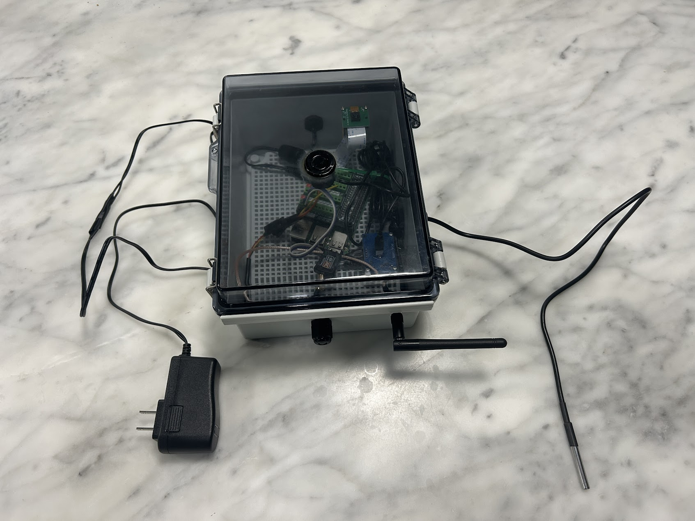

# Keuka Sensor by Matt Reidy

---

## 0) Endpoints (compatibility preserved)

- `GET /` → plain text: `waterTempF,medianDistanceInches` (two decimals).
- `GET /health` → JSON with readings + status.
- `GET /admin` (Basic Auth) → links to Wi‑Fi, Software Update, DuckDNS, Terminal

Default admin credentials: **`admin/password`**.

---

## 1) High‑level overview
- Raspberry Pi micro-controller.
- Measures **water level** (down‑looking ultrasonic) and **water temperature** (DS18B20 at lake bottom).
- Streams a **webcam** for situational awareness.
- **Provisioning AP** for setup via mobile device (phone): onboard Wi‑Fi (**wlan0**) advertises `keukasensor` at `192.168.50.1`.
- Field link uses a **USB 2.4 GHz Wi‑Fi adapter with external RP‑SMA antenna** on **wlan1** for range.

---

## 2) Consolidated Bill of Materials (BoM)

Estimated 2025 costs

### 📦 Bill of Materials (BOM)

| Qty | Item                                                                                                     | Price (USD) | Notes |
|-----|----------------------------------------------------------------------------------------------------------|-------------|-------|
| 1   | Raspberry Pi 3B+                                                                                         | $55         | Main controller board |
| 1   | HCDC RPi GPIO Status LED & Terminal Block Breakout Board HAT                                             | $25         | Simplifies wiring and provides GPIO status LEDs |
| 1   | Raspberry Pi Mini Camera Video Module (OV5647, 5 MP, 1080p)                                              | $10         | CSI ribbon connection for live video feed |
| 1   | AC600 Mbps Dual Band USB Wi-Fi Adapter (2.4/5 GHz) with Antenna                                          | $25         | Improved wireless connectivity |
| 1   | JSN-SR04T Waterproof Ultrasonic Sensor                                                                   | $15           | Distance measurement |
| 2   | Resistors (1 kΩ, 2 kΩ)                                                                                   | —           | Voltage divider for ultrasonic ECHO pin |
| 1   | DS18B20 Temperature Sensor                                                                               | $15           | Temperature measurement |
| 1   | Resistor (4.7 kΩ)                                                                                         | —           | Temperature |
| —   | Misc wiring and other components                                                                         | $15           |  |
| 1   | Zulkit Junction Box Waterproof Clear Cover 8.7"x6.7"x4.3"                                                | $30         |  |

**Typical build total:** **≈ $200**.

---

## 3) Mechanical layout & mounting

- Enclosure mounted **vertical**, clear lid **down** facing water.  
- Drill **~18 mm hole** in the lid for the **JSN‑SR04T transducer head** (must be exposed; seal with O‑ring/silicone). Controller PCB stays inside.
- Place **webcam** behind the clear lid; add a small black foam shroud to reduce reflections.
- Side penetrations: **PG7** (DS18B20) and **PG9** (power). Drill **6.5–7 mm** for the **RP‑SMA bulkhead**.
- Target transducer height **36–60 in** above typical water level.
- Mounting: **L‑bracket + stainless clamps** to dock/post. Slight tilt if the camera sees the ultrasonic head.

---

## 4) Electrical Wiring (Summary)

This system uses both a **JSN-SR04T ultrasonic sensor** (with resistor divider) and a **DS18B20 temperature sensor**.  
Follow these connections to ensure reliable operation:

- **JSN-SR04T** (waterproof ultrasonic):
  - **TRIG** → GPIO 23
  - **ECHO** → GPIO 24 via **1 kΩ + 2 kΩ** resistor divider (5 V → 3.3 V)
  - **VCC** → 5 V
  - **GND** → Ground
  - *(Optional)* **0.1 µF** ceramic capacitor across VCC and GND at the sensor for noise suppression

- **DS18B20** (temperature):
  - **DATA** → GPIO 4
  - **VCC** → 3.3 V
  - **GND** → Ground
  - **4.7 kΩ** pull-up resistor between DATA and 3.3 V

- **USB Wi-Fi** adapter → any free Raspberry Pi USB port

---

## 5) Provisioning AP (onboard wlan0)

- **SSID**: `keukasensor`  
- **Password**: `keuka1234`  
- **AP address**: `192.168.50.1` 

---

## 6) Services & runtime (systemd)

- **App**: `/etc/systemd/system/keuka-sensor.service`  

- **DuckDNS updater**:  
  - `/etc/systemd/system/duckdns-update.service`  
  - `/etc/systemd/system/duckdns-update.timer` (5‑minute interval)

---